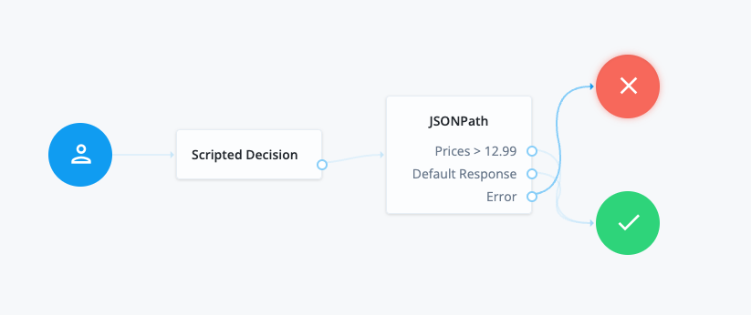

# JSONPath

A simple authentication node for ForgeRock's [Identity Platform][forgerock_platform] 7.4.0 and above. This node implements JSON Path filter search to grab values or execute an expression on a JSON Object in Shared State

## Inputs

Key in shared state that's value is a JSON Object

## Compatibility

<table>
  <colgroup>
    <col>
    <col>
  </colgroup>
  <thead>
  <tr>
    <th>Product</th>
    <th>Compatible?</th>
  </tr>
  </thead>
  <tbody>
  <tr>
    <td><p>ForgeRock Identity Cloud</p></td>
    <td><p><span>Yes</span></p></td>
  </tr>
  <tr>
    <td><p>ForgeRock Access Management (self-managed)</p></td>
    <td><p><span>Yes</span></p></td>
  </tr>
  <tr>
    <td><p>ForgeRock Identity Platform (self-managed)</p></td>
    <td><p><span>Yes</span></p></td>
  </tr>
  </tbody>
</table>

## How to use 

To use JSONpath expressions for the Node, use an expression of the form `<shared state variable>.$.<path>`

for example, given a shared state variable called "myJson" containing this JSON data:

```
{
  "username": "bob",
  "firstName": "Bob",
  "lastname": "Fleming",
  "telephoneNumber": "+1(555)1231234",
  "bookingIDs": [ 29872, 23884, 48382 ],
  "membershipTier": "platinum"
}
```

the "firstname" and "lastname" attributes can be selected as `${myJson.$.firstname}` and `${myJson.$.lastname}` respectively.
The last booking ID can be selected as `${myJson.$.bookingIDs[2]}` or `${myJson.$.bookingIDs[-1]}`.

An example to filter all of the `membershipTier`'s that are `platinum` from the `myJson` JSON Object into a Key named `Priority` into the Shared State
- Key: Priority
- myJson.$.[?(@.membershipTier == 'platinum')]

  To insert into Object Attributes start the Key with `objectAttributes` followed by `.keyName`
An example to filter all of the `membershipTier`'s that are `platinum` from the `myJson` JSON Object into a Key named `Priority` into Object Attributes

  - Key: objectAttribute.Priority
  - myJson.$.[?(@.membershipTier == 'platinum')]

Full details of [JSONpath](https://github.com/json-path/JsonPath/blob/master/README.md) expressions can be found [here](https://github.com/json-path/JsonPath/blob/master/README.md).


## Configuration
<table>
<thead>
    <th>Property</th>
    <th>Usage</th>
</thead>
<tr>
<td>Insert into Shared State or Object Attributes</td>
<td>Key - variable name to be inserted into Shared State or Object Attributes. To insert into Object Attributes; use <code>objectAttributes.{key}</code> format<br>
    Value - Value to be inserted into Shared State or Object Attributes. Wrap value in "" to insert static value into Shared State. Value can JSON Path value as well
</td>
</tr>
<tr>
<td>JSON Path filter to become outcome</td>
<td>If JSON Path filter matches; The node will go to that outcome. More than one matching JSON Path filter will result in the <code>Error</code> outcome</td>
</tr>
</table>

## Outputs

Key in Shared State or Object Attributes with static value or Json Path expression value

## Outcomes

`JSON Path`

JSON Path filter successfully matched

`Default Response`

Successfully created a new value in the Shared State with the returned value of the JSON Path expression


`Error`

An error occurred causing the Node to fail. Check the logs to see more details of the error. 

## Examples




