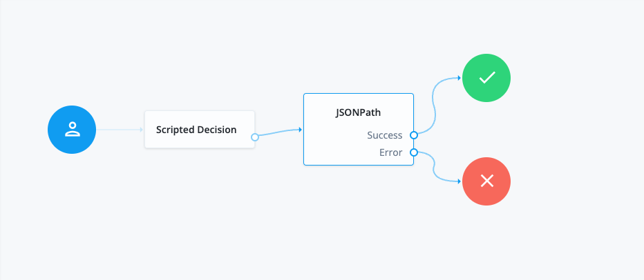

# JSONPath

A simple authentication node for ForgeRock's [Identity Platform][forgerock_platform] 7.4.0 and above. This node implements JSON Path filter search to grab values or execute an expression on a JSON Object in Shared State

## Inputs

Key in shared state that's value is a JSON Object

Example

There is a JSON value in the shared state

In the mappings of the JSON Path Node  

The key will be the new shared state item name

The value is the JSON Path (e.g. myJSONExample.$..book.length())

## Configuration
<table>
<thead>
    <th>Property</th>
    <th>Usage</th>
</thead>
<tr>
<td>Insert into Shared State</td>
<td>Values to insert into Shared State. Wrapping value in " " will put that value straight into Shared State. Don't wrap to do JSON Path filter search.</td>
</tr>
<tr>
<td>JSON Path filter to become outcome</td>
<td>JSON Path that will become the outcome.</td>
</tr>
</table>

## Outputs

Key in Shared State with the value of the Json Path expression

## Outcomes

`JSON Path`

Filter successfully matched

`Next`

Successfully created a new value in the Shared State with the returned value of the JSON Path expression

`Error`

An error occurred causing the request to fail. Check the response code, response body, or logs to see more details of the error. 
## Examples

